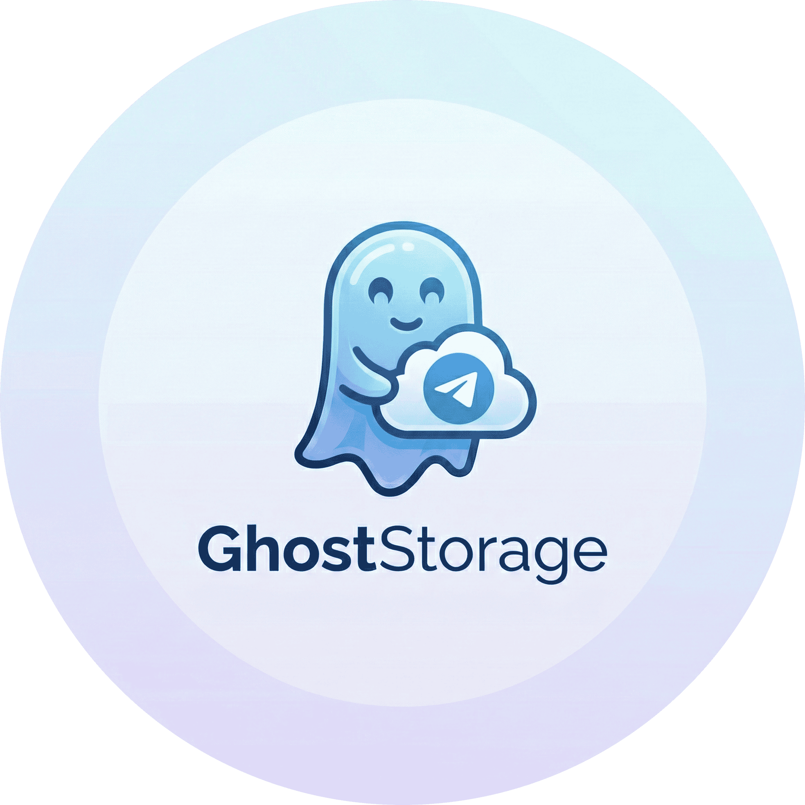

<div align="center">



<h1>👻 GhostStorage</h1>
<h3>Unlimited Cloud Storage using Telegram as a Backend</h3>


<tr>
<td><a href="https://python.org"></a></td>
<td><a href="https://www.djangoproject.com/"></a></td>
<td><a href="https://docs.telethon.dev/"></a></td>
</tr>

<br />
</div>

## ⚡ Features

- **Unlimited Cloud Storage**: Uses Telegram Channels as a storage backend to host files of unlimited quantity.

- **Zero Disk Usage**: Files are streamed chunk-by-chunk from the user → RAM → Telegram. Nothing is ever saved to the server's disk.

- **Streaming Download**: Watch videos or download files instantly without waiting for them to "buffer" on the server first.

- **Async Core**: Built on **Django Async** and **Telethon** to handle multiple concurrent uploads/downloads without blocking.

- **User-Friendly UI**: Simple, clean web interface for uploading and managing files.

<br>

## 🛠️ Installation & Setup

### 1. Prerequisites
You need **Python 3.9+**.

### On Ubuntu/Debian:
```
sudo apt update
sudo apt install python3 python3-pip -y
```

### 2. Clone the Repository
```
git clone https://github.com/AmirAzade/GhostStorage.git
cd GhostStorage
```

### 3. Install Dependencies
```
pip install -r requirements.txt
```

## ⚙️ Configuration

### 1. Environment Variables
Create a .env file in the root directory and fill in your details:
```
nano .env
```

### Inside .env:
```
# Django Settings
DEBUG=True

# Telegram Credentials (get from my.telegram.org)
TG_API_ID=12345678
TG_API_HASH=your_api_hash_here
TG_SESSION_NAME=mysession

# Your Private Channel ID (e.g., -100xxxxxxx)
TG_CHANNEL_ID=-1001234567890
```

### 2. Generate Telegram Session
Since Telegram requires an initial OTP login, you must generate a session file once before running the server.
```
python scripts/create_session.py
```
Follow the on-screen prompts to log in. This will create mysession.session in your root folder.

## 🚀 Usage
To enable streaming capabilities, you must run the application using Uvicorn (ASGI), not the standard Django runserver.

### Run the Server:
```
uvicorn GhostStorage.asgi:application --host 0.0.0.0 --port 8000
```

### Access the Web Interface:
Open your browser and visit: http://localhost:8000 (or your VPS IP).

- **Upload**: Select a file and click upload. Watch the progress bar as it pipes data to Telegram.
- **Download**: Click the download link to stream the file back from Telegram instantly.

## 📂 Project Structure
```
📂 GhostStorage/
├── 📄 manage.py                # Django CLI
├── 📄 requirements.txt         # Dependencies
├── 🔒 .env                     # API Keys (Ignored by Git)
├── 🔐 mysession.session        # Auth File (Ignored by Git)
│
├── 📂 GhostStorage/            # Project Settings
│   ├── 📄 asgi.py              # ASGI Entry point (for Uvicorn)
│   ├── 📄 settings.py          # Configuration
│   └── 📄 urls.py              # URL Routing
│
├── 📂 core/                    # Main Application Logic
│   ├── 📄 client.py            # Telethon Client Singleton
│   ├── 📄 views.py             # Streaming Views (Upload/Download)
│   └── 📄 apps.py              # App Configuration
│
└── 📂 scripts/                 # Utility Scripts
    └── 📄 create_session.py    # Session Generator
```

## 🛡️ Disclaimer
This project is for educational purposes. Please use it responsibly and ensure you comply with Telegram's Terms of Service regarding file storage and API usage.

<div align="center">
<sub>Built with ❤️ using Python & Django </sub>
</div>